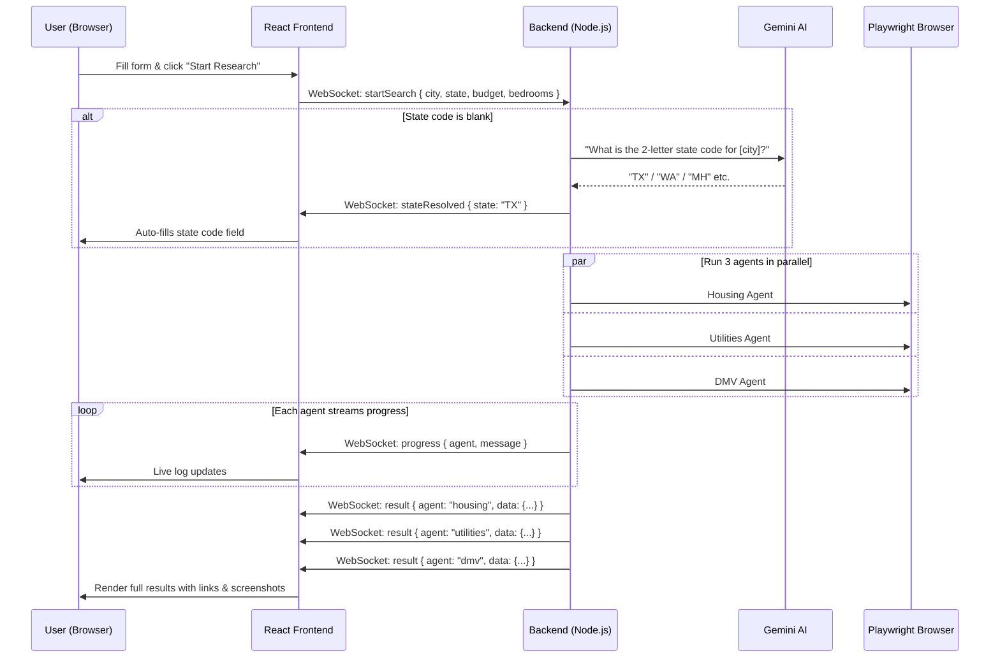
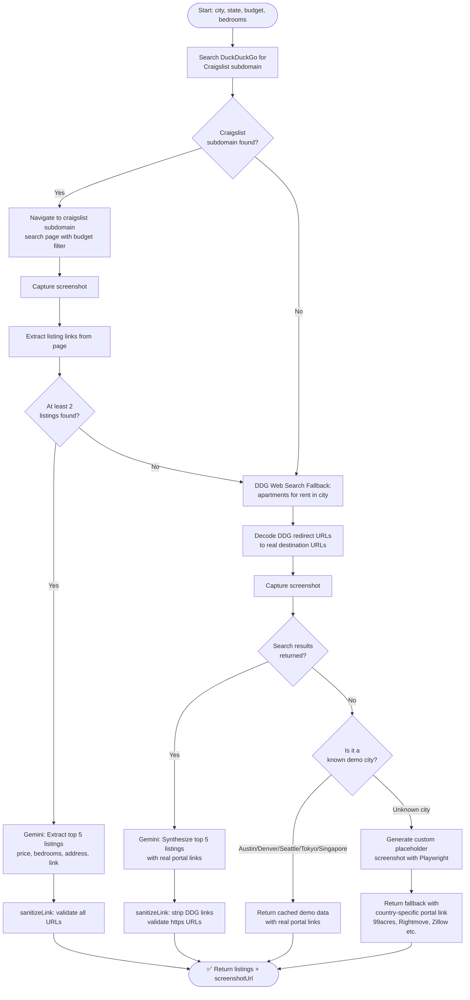
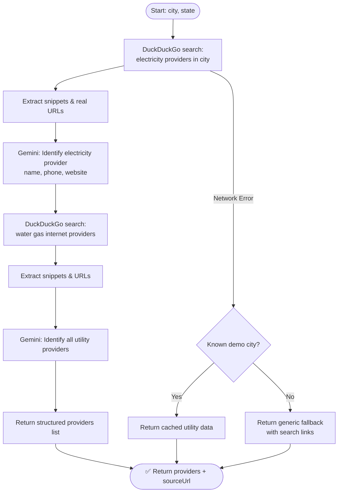
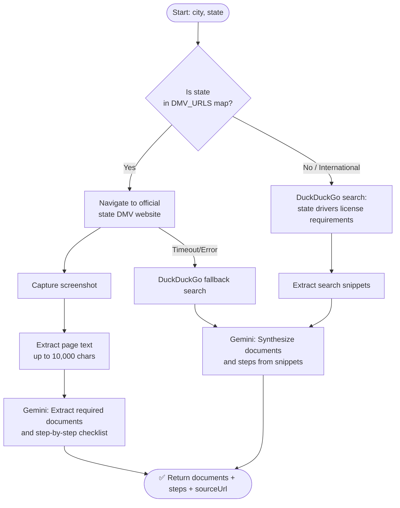
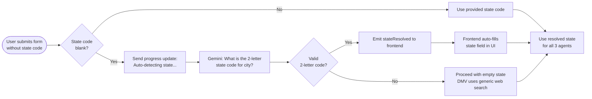

# 🏠 Moving Day — The Concierge That Actually Leaves Its Desk

> An AI-powered relocation assistant that researches housing, utilities, and DMV requirements for your move — all in parallel, all in real time.

[](https://nodejs.org/)
[](https://reactjs.org/)
[](https://vitejs.dev/)
[](https://playwright.dev/)
[](https://ai.google.dev/)

---

## 📖 Table of Contents

- [Overview](#-overview)
- [Features](#-features)
- [Tech Stack](#-tech-stack)
- [System Architecture](#-system-architecture)
- [Agent Workflow Diagrams](#-agent-workflow-diagrams)
- [Project Structure](#-project-structure)
- [Prerequisites](#-prerequisites)
- [Installation & Setup](#-installation--setup)
- [Environment Variables](#-environment-variables)
- [Running the App](#-running-the-app)
- [How It Works](#-how-it-works)
- [Demo Mode vs Live Mode](#-demo-mode-vs-live-mode)
- [API Reference](#-api-reference)
- [Known Limitations](#-known-limitations)
- [Contributing](#-contributing)

---

## 🌟 Overview

**Moving Day** is a full-stack web application that acts as your personal relocation concierge. Enter your current city, destination city, budget, and bedroom requirements — and three AI agents immediately fan out in parallel to research:

1. 🏠 **Housing** — Finds real apartment listings via Craigslist or a web search fallback
2. ⚡ **Utilities** — Identifies electricity, water, gas, and internet providers at the destination
3. 🚗 **DMV** — Fetches official driver's license transfer requirements for the destination state

Results are streamed back to the browser in real time using WebSockets, so you watch each agent work live.

---

## ✨ Features

| Feature | Description |
|---|---|
| 🤖 **3 Parallel AI Agents** | Housing, Utilities, and DMV agents run simultaneously |
| 🔴 **Real-Time Streaming** | WebSocket-based live progress updates in the UI |
| 🌍 **Global City Support** | Works for US cities (Craigslist) and international cities (web search fallback) |
| 🔍 **Auto State Detection** | Gemini AI auto-detects the 2-letter state code if you leave it blank |
| 📸 **Verification Screenshots** | Each agent captures a screenshot of the source page as proof |
| 📥 **PDF Export** | Download a full relocation brief as a formatted Markdown/PDF |
| 🌙 **Dark Mode UI** | Premium glassmorphism design with smooth animations |
| 🔗 **Real Listing Links** | All housing links point to live real-estate portals |
| 🏎️ **Demo Mode** | Test the app instantly with pre-cached data for 5 demo cities |

---

## 🛠 Tech Stack

### Frontend
| Technology | Purpose |
|---|---|
| **React 19** | UI framework |
| **Vite 8** | Build tool & dev server |
| **Tailwind CSS 4** | Utility-first styling |
| **Framer Motion** | Animations & transitions |
| **Lucide React** | Icon library |

### Backend
| Technology | Purpose |
|---|---|
| **Node.js 22** | Runtime |
| **Express.js** | HTTP server & static file serving |
| **ws (WebSockets)** | Real-time streaming to browser |
| **Playwright** | Headless Chromium browser automation |
| **Google Gemini 2.5 Flash** | AI for data extraction, link parsing, state detection |
| **dotenv** | Environment variable management |

---

## 🏗 System Architecture

```
┌─────────────────────────────────────────────────────────────────┐
│                        BROWSER (Client)                         │
│                                                                 │
│   ┌─────────────────────────────────────────────────────────┐   │
│   │              React Frontend (Vite)                      │   │
│   │  ┌────────────┐  ┌────────────┐  ┌────────────────┐    │   │
│   │  │  Form UI   │  │ Agent Cards│  │  Live Log Feed  │    │   │
│   │  │ (inputs)   │  │ (results)  │  │  (WebSocket)    │    │   │
│   │  └────────────┘  └────────────┘  └────────────────┘    │   │
│   └────────────────────────┬────────────────────────────────┘   │
│                            │ WebSocket (ws://)                  │
└────────────────────────────┼────────────────────────────────────┘
                             │
┌────────────────────────────▼────────────────────────────────────┐
│                   Node.js Backend Server                        │
│                    (Express + WebSocketServer)                  │
│                    http://localhost:3001                        │
│                                                                 │
│   ┌─────────────────────────────────────────────────────────┐   │
│   │              WebSocket Message Handler                  │   │
│   │                                                         │   │
│   │  1. Parse "startSearch" event                          │   │
│   │  2. Auto-resolve state code (Gemini) if missing        │   │
│   │  3. Fan out to 3 agents in parallel (Promise.all)      │   │
│   └──────────────┬──────────────┬──────────────┬────────────┘   │
│                  │              │              │                 │
│         ┌────────▼──┐  ┌───────▼───┐  ┌──────▼──────┐         │
│         │  Housing  │  │ Utilities │  │     DMV     │         │
│         │   Agent   │  │   Agent   │  │    Agent    │         │
│         └────────┬──┘  └───────┬───┘  └──────┬──────┘         │
│                  │              │              │                 │
│         ┌────────▼──────────────▼──────────────▼────────┐      │
│         │        Playwright Headless Chromium            │      │
│         │     (Scrapes web pages, takes screenshots)     │      │
│         └────────────────────┬───────────────────────────┘      │
│                              │                                  │
│         ┌────────────────────▼───────────────────────────┐      │
│         │           Google Gemini 2.5 Flash              │      │
│         │   (Extracts structured data from raw HTML)     │      │
│         └────────────────────────────────────────────────┘      │
└─────────────────────────────────────────────────────────────────┘
```

---

## 🔄 Agent Workflow Diagrams

### Overall Request Flow



---

### 🏠 Housing Agent Workflow



---

### ⚡ Utilities Agent Workflow



---

### 🚗 DMV Agent Workflow



---

### 🔍 Auto State Resolution Flow



---

## 📁 Project Structure

```
Moving-Day/
├── package.json                  # Root scripts (setup, start, demo)
├── README.md
│
├── frontend/                     # React + Vite application
│   ├── src/
│   │   ├── App.jsx               # Main application component
│   │   ├── index.css             # Global styles (glassmorphism, tokens)
│   │   └── main.jsx              # React entry point
│   ├── public/
│   └── package.json
│
└── backend/                      # Node.js server
    ├── index.js                  # Express + WebSocket server, agent coordinator
    ├── .env                      # API keys (not committed)
    ├── agents/
    │   ├── housingAgent.js       # Housing scraper + Gemini extractor
    │   ├── utilitiesAgent.js     # Utilities scraper + Gemini extractor
    │   └── dmvAgent.js           # DMV scraper + Gemini extractor
    ├── data/
    │   └── cachedData.js         # Demo mode mock data + DMV URL map
    └── public/
        └── screenshots/          # Agent screenshot storage
```

---

## ✅ Prerequisites

Before you begin, ensure you have the following installed:

| Tool | Minimum Version | Download |
|---|---|---|
| **Node.js** | v18+ (v22 recommended) | [nodejs.org](https://nodejs.org/) |
| **npm** | v9+ | Bundled with Node.js |
| **Git** | Any | [git-scm.com](https://git-scm.com/) |
| **Google Gemini API Key** | Free tier available | [aistudio.google.com](https://aistudio.google.com/) |

---

## 🚀 Installation & Setup

### 1. Clone the repository

```bash
git clone https://github.com/Ayushtitan123/Moving-Day-The-Concierge-That-Actually-Leaves-Its-Desk.git
cd Moving-Day-The-Concierge-That-Actually-Leaves-Its-Desk
```

### 2. Install all dependencies

```bash
npm run setup
```

This single command will:
- Install root dependencies
- Install backend dependencies (`/backend/node_modules`)
- Install frontend dependencies (`/frontend/node_modules`)
- Download and install Playwright's Chromium browser

### 3. Configure environment variables

```bash
cd backend
copy .env.example .env       # Windows
# OR
cp .env.example .env         # Mac/Linux
```

Then open `backend/.env` and fill in your API key (see [Environment Variables](#-environment-variables)).

---

## 🔑 Environment Variables

Create a file at `backend/.env`:

```env
# Required: Get your key from https://aistudio.google.com/
GEMINI_API_KEY=your_gemini_api_key_here

# Optional: Run in demo mode with pre-cached data (no API needed)
DEMO_MODE=false
```

| Variable | Required | Description |
|---|---|---|
| `GEMINI_API_KEY` | ✅ Yes (Live mode) | Google Gemini AI API key for data extraction |
| `DEMO_MODE` | ❌ Optional | Set to `true` to use cached data without any API calls |

> [!TIP]
> Get a free Gemini API key at **[aistudio.google.com](https://aistudio.google.com/)**. The free tier supports up to 1,500 requests/day.

---

## ▶️ Running the App

### Live Mode (real web scraping + AI)

```bash
npm run start
```

| Service | URL |
|---|---|
| **Frontend** | http://localhost:5173 |
| **Backend API** | http://localhost:3001 |
| **WebSocket** | ws://localhost:3001 |

### Demo Mode (instant results, no API key needed)

```bash
npm run start:demo
```

Demo mode uses pre-cached data for these 5 cities:
- 🇺🇸 **Austin, TX**
- 🇺🇸 **Denver, CO**
- 🇺🇸 **Seattle, WA**
- 🇯🇵 **Tokyo, Japan**
- 🇸🇬 **Singapore**

---

## 💡 How It Works

### Step-by-Step User Journey

```
1. USER OPENS APP
   └─ Browser connects to http://localhost:5173

2. USER FILLS FORM
   ├─ Current City (e.g. "New York")
   ├─ Destination City (e.g. "Austin")
   ├─ Destination State Code — OPTIONAL (e.g. "TX")
   │   └─ If blank → Gemini auto-detects it
   ├─ Move Date
   ├─ Max Rent Budget ($)
   └─ Number of Bedrooms

3. USER CLICKS "Start Relocation Research"
   └─ WebSocket message sent to backend

4. BACKEND PROCESSES REQUEST
   ├─ [Optional] Auto-resolve state code via Gemini
   ├─ Fan out 3 agents simultaneously
   │
   ├─ HOUSING AGENT:
   │   ├─ Search DuckDuckGo for Craigslist subdomain
   │   ├─ Navigate to Craigslist (if found) OR DDG web search
   │   ├─ Capture screenshot as proof
   │   └─ Extract top 5 listings via Gemini
   │
   ├─ UTILITIES AGENT:
   │   ├─ Search for electricity, water, gas, internet providers
   │   └─ Extract provider info via Gemini
   │
   └─ DMV AGENT:
       ├─ Look up official DMV URL for the state
       ├─ Scrape the official government page
       └─ Extract documents needed + step-by-step checklist via Gemini

5. RESULTS STREAMED TO BROWSER
   └─ Each card updates live as its agent completes

6. USER DOWNLOADS PDF BRIEF
   └─ Click "Download Brief" to export all results as Markdown
```

---

## 🎭 Demo Mode vs Live Mode

| Feature | Demo Mode | Live Mode |
|---|---|---|
| **Speed** | ~2-3 seconds | 30-90 seconds |
| **API Key Required** | ❌ No | ✅ Yes (Gemini) |
| **Real Listings** | ❌ Cached data | ✅ Live from web |
| **Works for any city** | ❌ 5 cities only | ✅ Any city worldwide |
| **Screenshots** | Pre-captured images | Live captures |
| **Start command** | `npm run start:demo` | `npm run start` |

---

## 📡 API Reference

### WebSocket Events

**Client → Server**

```json
{
  "type": "startSearch",
  "data": {
    "currentCity": "New York",
    "destinationCity": "Austin",
    "destinationState": "TX",
    "moveDate": "2025-09-01",
    "budget": 2000,
    "bedrooms": 2
  }
}
```

**Server → Client**

| Event Type | Description | Payload |
|---|---|---|
| `stateResolved` | Auto-detected state code | `{ state: "TX" }` |
| `progress` | Agent progress update | `{ agent, status, message }` |
| `result` | Agent completed with data | `{ agent, data: {...} }` |
| `error` | Agent failed | `{ agent, message }` |

---

## ⚠️ Known Limitations

| Limitation | Details |
|---|---|
| **Gemini Rate Limits** | Free tier: 20 requests/minute. Running multiple searches quickly may trigger a 429 error |
| **DuckDuckGo Throttling** | Aggressive scraping may result in connection resets (`ERR_CONNECTION_RESET`) |
| **Craigslist Coverage** | Only US cities with Craigslist subdomains get Craigslist results; international cities use web search fallback |
| **DMV Timeouts** | Some state government websites are slow and may time out (agent falls back to web search) |
| **No Persistent Storage** | Results are not saved between sessions |

---

## 🤝 Contributing

1. Fork the repository
2. Create your feature branch: `git checkout -b feature/your-feature`
3. Commit your changes: `git commit -m 'feat: add your feature'`
4. Push to the branch: `git push origin feature/your-feature`
5. Open a Pull Request

---

## 📄 License

This project was built as a Capstone Project. All rights reserved.

---

<p align="center">
  Built with ❤️ using React, Node.js, Playwright & Google Gemini AI
</p>
