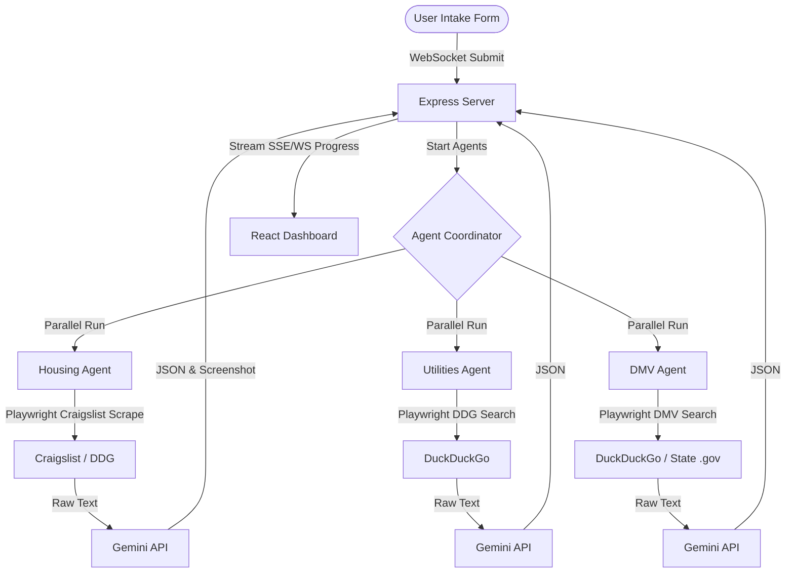

# Implementation Plan - Moving Day Relocation Assistant

"Moving Day" is a relocation concierge web application that helps users move to a new city by performing real-time web research using automated browser agents and consolidating findings into a live-updating dashboard.

## User Review Required

> [!IMPORTANT]
> **API Key Requirements:** The app leverages the existing system `GEMINI_API_KEY` to query Gemini models (`gemini-1.5-flash`) for parsing raw scraped text.
>
> **Browser Automation:** We will use Playwright to automate the searches. The backend will run headless browsers to scrape Craigslist, DuckDuckGo, and official state DMV sites. Because websites change, we use a search-then-parse strategy where Playwright grabs raw text/results and Gemini structures them into clean JSON, ensuring high resilience.
>
> **Parallel Scrapes & Port:** The backend will run on port `3001` and host the WebSocket server. The frontend will run on port `5173` via Vite.

## Open Questions

> [!NOTE]
> 1. **Rental Source:** We propose using Craigslist as the primary source for the Housing Agent. It doesn't block automated scrapers (unlike Zillow/Apartments.com which use heavy Cloudflare/anti-bot protection) and has a consistent layout across all US cities. Is this acceptable, or should we attempt fallback web search queries?
> 2. **Export Format:** We will support exporting to Markdown (.md) and opening a print-optimized window that lets the user print/save the dashboard as a clean PDF. Does this cover the export requirements?

---

## Proposed Changes

We will organize the project as a monorepo in `d:\Capstone Project` containing two main folders: `backend` and `frontend`, with a root-level `package.json` to start both concurrently.

### 1. Root Configuration

#### [NEW] [package.json](file:///d:/Capstone%20Project/package.json)
Contains scripts to install dependencies and run both backend and frontend concurrently.
- Dependencies: `concurrently` (as devDependency)
- Scripts: `install:all`, `start`

#### [NEW] [.gitignore](file:///d:/Capstone%20Project/.gitignore)
Standard ignore rules for Node modules, Vite build files, screenshots, and `.env` files.

---

### 2. Backend Server

The backend is built in Node.js/Express. It coordinates the parallel execution of the three agents and streams progress and final data back to the client using a WebSocket connection (`ws`).

#### [NEW] [backend/package.json](file:///d:/Capstone%20Project/backend/package.json)
- Dependencies: `express`, `ws`, `cors`, `dotenv`, `playwright`, `@google/generative-ai`

#### [NEW] [backend/index.js](file:///d:/Capstone%20Project/backend/index.js)
- Initializes Express server and WebSocket server on port `3001`.
- Serves `public/screenshots/` statically.
- Listens for WebSocket connections. When a connection receives a `startSearch` event:
  1. Instantiates all three agents.
  2. Runs them in parallel.
  3. Sends real-time progress messages (e.g., `housing:searching`, `housing:scraping`, `housing:complete`).
  4. Sends final JSON payloads for each agent as they finish.

#### [NEW] [backend/agents/housingAgent.js](file:///d:/Capstone%20Project/backend/agents/housingAgent.js)
- Inputs: `city`, `state`, `budget`, `bedrooms`
- Process:
  1. Use DuckDuckGo to search for `Craigslist apartments for rent in [city] [state]`.
  2. Find the correct Craigslist subdomain URL (e.g., `https://austin.craigslist.org/search/apa`).
  3. Navigate Playwright to Craigslist with query params: `max_price=[budget]&min_bedrooms=[bedrooms]&max_bedrooms=[bedrooms]`.
  4. Wait for content to load, take a screenshot, and save to `backend/public/screenshots/housing_[timestamp].png`.
  5. Scrape listing titles, links, prices, and locations.
  6. Pass the listing text to Gemini to clean up and return the top 5 structured listings (address, price, bedrooms, link).
  7. Return listings and screenshot URL.

#### [NEW] [backend/agents/utilitiesAgent.js](file:///d:/Capstone%20Project/backend/agents/utilitiesAgent.js)
- Inputs: `city`, `state`
- Process:
  1. Use Playwright to search DuckDuckGo for:
     - `electricity providers in [city] [state]`
     - `water utility [city] [state]`
     - `internet providers in [city] [state]`
  2. Scrape the search result snippets and text.
  3. Pass the raw text to Gemini with a system prompt asking to extract the primary internet, electricity, and water providers along with customer service numbers and URLs.
  4. Return a structured JSON of providers.

#### [NEW] [backend/agents/dmvAgent.js](file:///d:/Capstone%20Project/backend/agents/dmvAgent.js)
- Inputs: `state`
- Process:
  1. Use Playwright to search DuckDuckGo for: `[state] DMV transfer driver license new resident official page`.
  2. Identify the first official government link (ending in `.gov` or `.state.[us]`).
  3. Navigate to that page, extract the text contents of the main content block.
  4. Pass the text to Gemini to extract the required documents (ID, residency proof, vehicle title, etc.) and a step-by-step transfer guide.
  5. Return structured JSON.

---

### 3. Frontend Application

The frontend is a Vite + React + Tailwind CSS single page application.

#### [NEW] [frontend/package.json](file:///d:/Capstone%20Project/frontend/package.json)
- Dependencies: `react`, `react-dom`, `lucide-react`, `framer-motion`

#### [NEW] [frontend/src/index.css](file:///d:/Capstone%20Project/frontend/src/index.css)
- Imports Tailwind CSS.
- Defines CSS custom variables for a modern "Deep Space / Relocation" theme (harmonious HSL colors: deep slate background, glassmorphism panel styles, and vibrant blue/violet accents).
- Custom keyframe animations for loading gradients.

#### [NEW] [frontend/src/App.jsx](file:///d:/Capstone%20Project/frontend/src/App.jsx)
- **State Management:** Handles intake form state, WebSocket connection, agent states (idle, searching, parsing, completed, error), and agent results.
- **Intake Form:** Clean layout with inputs for Current City, Destination City (with Auto-state detection or simple inputs), Move Date, Rent Budget ($), and Bedrooms.
- **WebSocket Handlers:** Establishes connection to backend, triggers search on submit, and streams updates.
- **Dashboard Grid:**
  - *Card 1: Housing Listings* - Displays Craigslist screenshot (clickable for modal view) and top 5 listings (prices, addresses, links) with customized status bars.
  - *Card 2: Utilities & Services* - Lists internet, electric, and water companies, contact numbers, and setup links.
  - *Card 3: DMV & Local Admin* - Outlines checklist of documents and ordered setup steps.
- **Export System:** A premium button that downloads a beautifully formatted markdown file and opens a clean print view for direct PDF generation.

---

## Verification Plan

### Automated Tests
- Since this is a live scraping system, we will write a CLI script `testAgents.js` in `backend/` to run the agent logic directly from the terminal for a single city input (e.g., Austin, TX) and output results to verify correctness of Playwright scraping and Gemini parsing.

### Manual Verification
1. Run the development server and access `http://localhost:5173`.
2. Fill out the intake form for `Austin, TX`, budget `$2500`, `2 bedrooms`.
3. Verify that:
   - The WebSocket connection is established.
   - The three agent cards show loading indicators and live status updates (e.g., "Searching...", "Parsing data...").
   - The Housing Agent successfully captures a screenshot and lists real-time apartments.
   - The Utilities Agent returns actual phone numbers and links.
   - The DMV Agent displays a concise checklist and transfer steps.
   - Clicking on the Housing screenshot shows a zoomed modal.
   - The Markdown export compiles all research into a single document.
   - The Print layout renders a clean, professional PDF preview.
